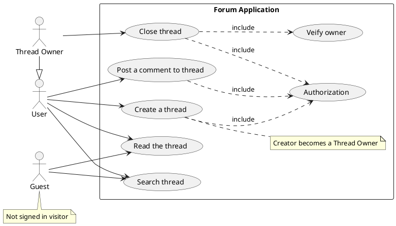

# forum application use case

```plantuml
@startuml

left to right direction

:User: as User
:Thread Owner: as Owner
:Guest: as Guest

Owner -|> User


rectangle "Forum Application" {
    (Authorization) as Auth
    (Veify owner) as Verify
    (Close thread) as CloseThread
    (Create a thread) as CreateThread
    (Post a comment to thread) as PostComment
    (Read the thread) as ReadThread
    (Search thread) as Search
    
    CloseThread ..> Verify : include
    CloseThread ..> Auth : include
    PostComment ..> Auth : include
    CreateThread ..> Auth : include
    
    note right of CreateThread
        Creator becomes a Thread Owner
    end note

    Owner --> CloseThread

    User --> CreateThread
    User --> PostComment
    User --> Search
    User --> ReadThread

    Guest --> Search
    Guest --> ReadThread
}
    
note bottom of Guest
    Not signed in visitor
end note

@enduml
```
